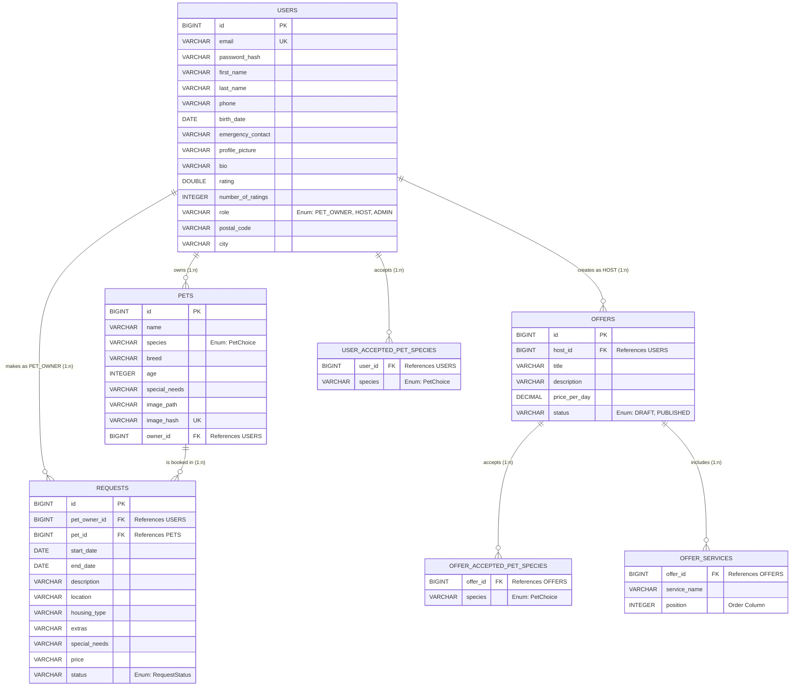

# Entity Relationship Diagramm (ERD)

Dieses Diagramm visualisiert das Datenbankmodell der Pawsitters-Applikation basierend auf den JPA-Entitäten (`User`, `Pet`, `Offer`, `Request`) sowie deren Relationen und automatisch generierten Hilfstabellen (für `@ElementCollection`).

