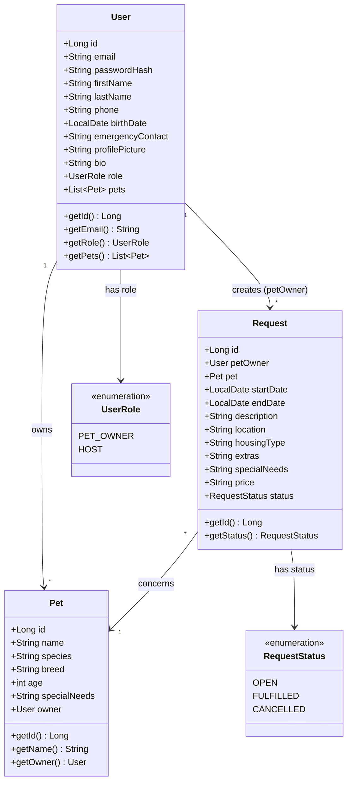

# Klassendiagramm

```mermaid
classDiagram
    class User {
        +Long id
        +String email
        +String passwordHash
        +String firstName
        +String lastName
        +String phone
        +LocalDate birthDate
        +String emergencyContact
        +String profilePicture
        +String bio
        +UserRole role
        +List~Pet~ pets
        +getId() Long
        +getEmail() String
        +getRole() UserRole
        +getPets() List~Pet~
    }

    class Pet {
        +Long id
        +String name
        +String species
        +String breed
        +int age
        +String specialNeeds
        +User owner
        +getId() Long
        +getName() String
        +getOwner() User
    }

    class Request {
        +Long id
        +User petOwner
        +Pet pet
        +LocalDate startDate
        +LocalDate endDate
        +String description
        +String location
        +String housingType
        +String extras
        +String specialNeeds
        +String price
        +RequestStatus status
        +getId() Long
        +getStatus() RequestStatus
    }

    class UserRole {
        <<enumeration>>
        PET_OWNER
        HOST
    }

    class RequestStatus {
        <<enumeration>>
        OPEN
        FULFILLED
        CANCELLED
    }

    User "1" --> "*" Pet : owns
    User "1" --> "*" Request : creates (petOwner)
    Request "*" --> "1" Pet : concerns
    User --> UserRole : has role
    Request --> RequestStatus : has status
```
