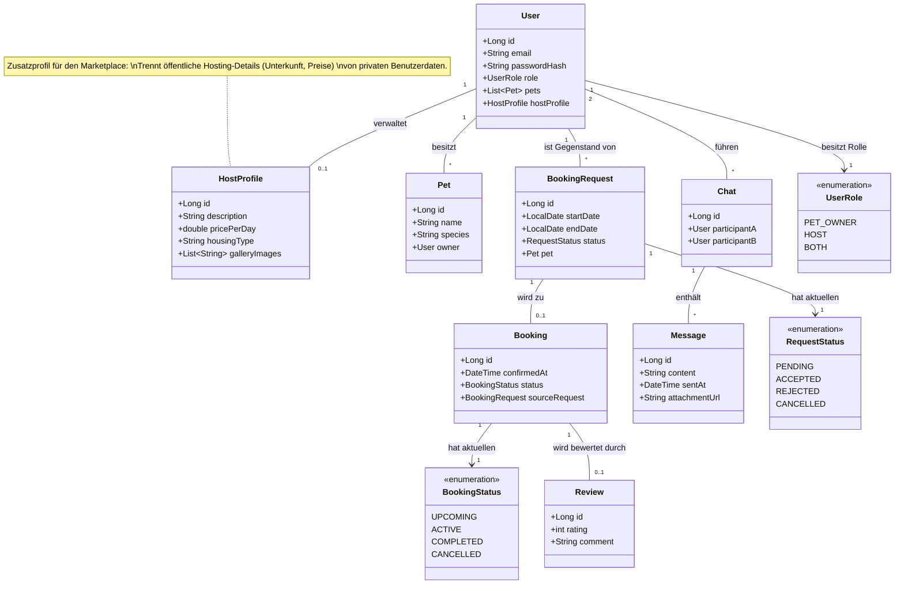

# Klassendiagramm

```mermaid
classDiagram
    class User {
        +Long id
        +String email
        +String passwordHash
        +UserRole role
        +List~Pet~ pets
        +HostProfile hostProfile
    }

    class HostProfile {
        +Long id
        +String description
        +double pricePerDay
        +String housingType
        +List~String~ galleryImages
    }
    note for HostProfile "Zusatzprofil für den Marketplace: \nTrennt öffentliche Hosting-Details (Unterkunft, Preise) \nvon privaten Benutzerdaten."

    class Pet {
        +Long id
        +String name
        +String species
        +User owner
    }

    class BookingRequest {
        +Long id
        +LocalDate startDate
        +LocalDate endDate
        +RequestStatus status
        +Pet pet
    }

    class Booking {
        +Long id
        +DateTime confirmedAt
        +BookingStatus status
        +BookingRequest sourceRequest
    }

    class Chat {
        +Long id
        +User participantA
        +User participantB
    }

    class Message {
        +Long id
        +String content
        +DateTime sentAt
        +String attachmentUrl
    }

    class Review {
        +Long id
        +int rating
        +String comment
    }

    class UserRole {
        <<enumeration>>
        PET_OWNER
        HOST
        BOTH
    }

    class RequestStatus {
        <<enumeration>>
        PENDING
        ACCEPTED
        REJECTED
        CANCELLED
    }

    class BookingStatus {
        <<enumeration>>
        UPCOMING
        ACTIVE
        COMPLETED
        CANCELLED
    }

    %% Verknüpfungen (Beziehungen)
    User "1" --> "1" UserRole : besitzt Rolle
    User "1" -- "0..1" HostProfile : verwaltet
    User "1" -- "*" Pet : besitzt
    User "1" -- "*" BookingRequest : ist Gegenstand von
    User "2" -- "*" Chat : führen
    
    BookingRequest "1" -- "0..1" Booking : wird zu
    BookingRequest "1" --> "1" RequestStatus : hat aktuellen
    
    Booking "1" --> "1" BookingStatus : hat aktuellen
    Booking "1" -- "0..1" Review : wird bewertet durch
    
    Chat "1" -- "*" Message : enthält
```
