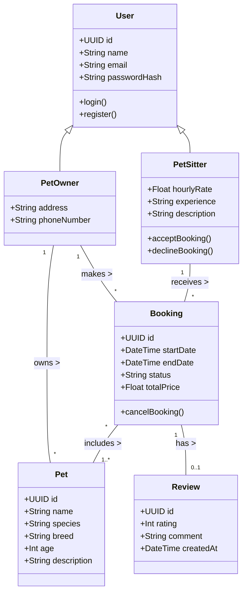

# Klassendiagramm

```mermaid
classDiagram
    class User {
        +UUID id
        +String name
        +String email
        +String passwordHash
        +login()
        +register()
    }

    class PetOwner {
        +String address
        +String phoneNumber
    }

    class PetSitter {
        +Float hourlyRate
        +String experience
        +String description
        +acceptBooking()
        +declineBooking()
    }

    class Pet {
        +UUID id
        +String name
        +String species
        +String breed
        +Int age
        +String description
    }

    class Booking {
        +UUID id
        +DateTime startDate
        +DateTime endDate
        +String status
        +Float totalPrice
        +cancelBooking()
    }

    class Review {
        +UUID id
        +Int rating
        +String comment
        +DateTime createdAt
    }

    User <|-- PetOwner
    User <|-- PetSitter

    PetOwner "1" -- "*" Pet : owns >
    PetOwner "1" -- "*" Booking : makes >
    PetSitter "1" -- "*" Booking : receives >
    Booking "1" -- "0..1" Review : has >
    Booking "*" -- "1..*" Pet : includes >
```
