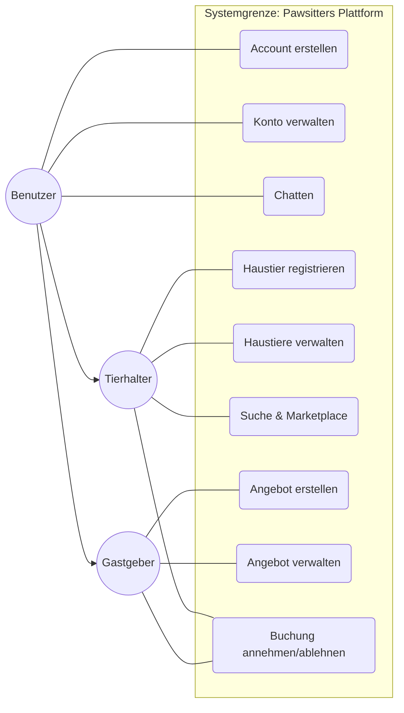

# Dokumentation der Anwendungsfälle

Hier ist das aktuelle Diagramm:

```mermaid
graph LR
    %% Akteure (Rund)
    User((Benutzer))
    Owner((Tierhalter))
    Host((Gastgeber))

    %% Beziehungen Akteure
    User --> Owner
    User --> Host

    subgraph Pawsitters_System [Systemgrenze: Pawsitters Plattform]
        %% Use Cases (Ovale)

        UC7(Account erstellen)
        UC1(Konto verwalten)
        UC2(Chatten)
        UC3(Haustier registrieren)
        UC8(Haustiere verwalten)
        UC4(Suche & Marketplace)
        UC5(Angebot erstellen)
        UC9(Angebot verwalten)
        UC6(Buchung annehmen/ablehnen)
    end

    %% Assoziationen
    User --- UC1
    User --- UC7
    User --- UC2
    Owner --- UC3
    Owner --- UC4
    Owner --- UC6
    Host --- UC5
    Host --- UC6
    Owner --- UC8
    Host --- UC9
```